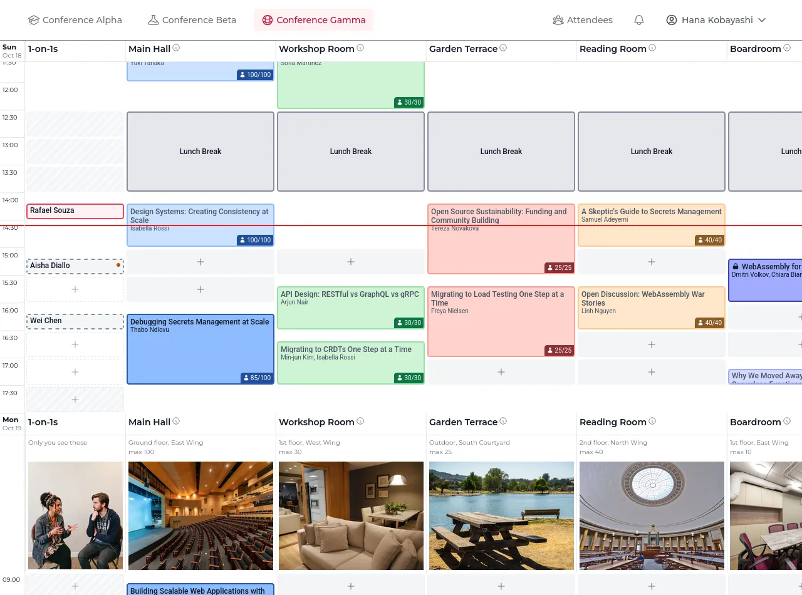
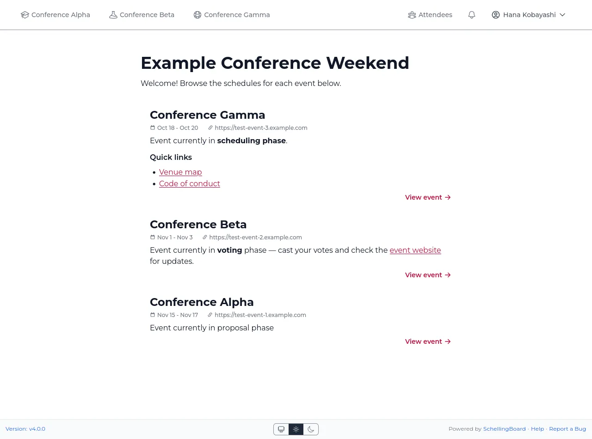

# How SchellingBoard works

## Attendee identity

By default there is no per-attendee login. After entering the site password
(if set), attendees pick their own name from the guest list assigned to that
event.

:::warning "The name picker is not authentication"
Anyone who knows the site password can select any attendee's name and
vote, RSVP, or edit proposals as them.
:::

Any attendee who wants more can **protect their name** from their own settings
page (see the [attendee guide](../attendee-guide.md#protect-your-name)).
Protection is opt-in and per-person; there is no way to require it event-wide.
Once a name is protected, picking it asks for a password or an emailed code,
and acting as that person needs that verified browser session. Turning
protection off or changing the password needs either the current password or a
fresh code, so a forgotten password is never a dead end.

Protection needs `AUTH_SECRET` and working email
([SMTP settings](../self-hosting/configuration.md#environment-variables)), so
the attendee can receive a code.

## Who can change a session or proposal

Only its hosts, with two exceptions: a proposal with **no** hosts can be
edited by anyone, so unclaimed ideas can be picked up; and an **admin-managed**
session can only be changed from the admin UI.

Name protection doesn't change _who_ may edit — it changes how hard it is to
_be_ that person. A session whose hosts are all unprotected is effectively open
to anyone willing to pick one of their names. Attendees who want their sessions
to really be theirs need to protect their name.

## The three phases

Each event has three independent, optional phase windows (start/end), set in
the admin UI:

| Phase          | What attendees can do                                                              |
| -------------- | ---------------------------------------------------------------------------------- |
| **Proposal**   | Submit and edit session proposals                                                  |
| **Voting**     | Vote on proposals (Interested / Maybe / Skip); proposals can still be added/edited |
| **Scheduling** | Place proposals on the grid, book open slots, RSVP to sessions                     |

- A phase with no explicit end runs until the _next_ configured phase's start.
  Giving a phase an earlier explicit end creates a dead gap where nothing is
  active.
- **No phase dates at all** means the event is always in the scheduling phase
  — useful for a fixed schedule with no proposal/voting step.
- All gating is enforced server-side, so attendees can't act out of phase via
  an old bookmarked link.

## Proposals, voting, and scheduling

- Voting has three choices (Interested / Maybe / Skip), one per guest per
  proposal; clicking the current choice again removes the vote. "Quick Voting"
  walks through unvoted proposals one at a time.
- A proposal's host can click "Schedule" (scheduling phase only) to place it
  on the grid. The same proposal can be scheduled more than once. Each
  session is a copy: later edits to the proposal do not reach it.
- Attendees can also book a blank slot directly in a "bookable" location
  during that day's booking window, without going through a proposal.
- A session's hosts can edit it for the whole scheduling phase, but not move
  one that has already started. Marking a session "admin-managed" is still
  what puts it beyond their reach entirely.
- Placing a session for someone — after bookings close for the day, in a room
  that isn't bookable, longer than the maximum — leaves the host able to fix
  its details without being forced to move it somewhere legal first. Only a
  time or room they actually change is held to the booking rules.
- RSVPs happen only during the scheduling phase, and only for guests assigned
  to the event. If the event enforces capacity as a hard limit, RSVPs are
  rejected once a session is full; otherwise capacity is advisory.

### The attendance prediction

During scheduling, a host opening their own proposal sees a vote breakdown:
turnout among the event's attendees, the split across the three choices, and a
predicted range of attendees (withheld below 10% turnout, or with no ❤️ votes).
Proposals with no host show the breakdown to everybody, since anyone may still
take them on.

:::warning "Treat the prediction as a very rough guess, and say so if attendees ask"
It rests on one event where thirteen hosts recalled roughly how many people
came, and it can be well out either way.
:::

The formula will be reworked as more events are recorded, and its assumptions
— today a fixed nine sessions running at once, and an attendee list that has
to be set up for the prediction to appear at all — are meant to become
per-event settings. **Don't tell attendees that ⭐ Maybe votes are worthless**:
today's formula doesn't use them, but that rests on the same thirteen sessions
and is far from settled.

## Kiosk mode

Append `?kiosk=1` to a schedule URL for an unattended screen at the venue: the
view auto-scrolls back to the red current-time line after a minute of no
interaction (everyone else gets that line too, plus a "Now" button to jump to
it, but no auto-scrolling), the screen is kept awake, and the page refreshes
periodically. It stays fully interactive, and sticks as visitors browse the
site until you turn it off with `?kiosk=0`. Add `&loc=Main+Hall` (repeatable)
to show only specific locations — handy for a kiosk in one room, or a
shareable filtered link.

## Multi-event installs

One deployment can host multiple events. With more than one event, the root
URL lists them all using the global site title/description/map (set in
[Site settings](admin-guide.md#site-settings)); with exactly one it redirects
straight to it. Each event lives entirely under its own `/{slug}` route —
there's no cross-event attendee state beyond the shared guest pool and the
picked name.

## Email

Email is optional. With SMTP unconfigured, SchellingBoard sends nothing at all
and the features below are simply unavailable. When it is configured, these
are the only messages ever sent:

| Email                | Sent to                                                               | Opt-out                         |
| -------------------- | --------------------------------------------------------------------- | ------------------------------- |
| **Login code**       | An attendee who asked to protect or unlock their name                 | None — it's requested on demand |
| **Session moved**    | Hosts and RSVP'd attendees, when a session's time or location changes | Per-attendee, in their settings |
| **Session deleted**  | Hosts and RSVP'd attendees, when their session is deleted             | Per-attendee, in their settings |
| **Added as co-host** | Attendees newly added as a co-host of a session                       | Per-attendee, in their settings |
| **Co-host joined**   | A proposal's hosts, when someone joins it as a co-host                | Per-attendee, in their settings |
| **New comment**      | A proposal's hosts, and earlier commenters who opted in               | Per-attendee, in their settings |
| **Test email**       | One guest, from the admin Users page                                  | n/a                             |

Nothing is emailed on votes, RSVPs, phase transitions, or edits to a session's
title or description. Whoever made a change is never emailed about their own
change.

Enabling email requires `SITE_URL` as well as the SMTP settings, so the
messages can link back to the site.
